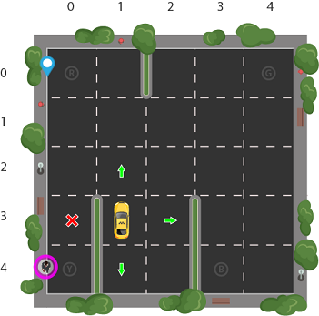

# portfolio

## What is this?
This project is a Sample of professional work. Here I show apps which are live and sample projects developed to showcase my skills.

## Technologies
Project is created with:
* Python
* Jupyter Notebook
* Kotlin
* Java
* C#

## Reinforcement Learning projects

### Taxi-V2 OpenCV - Reinforcement learning - QTables - [click here for more]()

### Bananas collector Agent with Deep Q networks - [click here for more](https://github.com/manuelsilverio/udacity_project_navigation)

A training an agent using Deep Q networks to navigate (and collect bananas!) in a large, square world.

A reward of +1 is provided for collecting a yellow banana, and a reward of -1 is provided for collecting a blue banana.  Thus, the goal of your agent is to collect as many yellow bananas as possible while avoiding blue bananas.  

The task is episodic, and in order to solve the environment, your agent must get an average score of +13 over 100 consecutive episodes.

This project has been solved on a Jupyter notebook 

### Pong Atari Agent with REINFORCE and Proximal Policy Optimization

### Double-joint arm Agent for udacity nano degree - [click here for more]()

## Supervised Learning projects

### Image Classification with Convolutional Neural Networks

## Android apps
	
Android apps live on GooglePlay
### Belgium Trains

### Train Catcher

### Driving test Training app

## Contact:

*LinkedIN: https://www.linkedin.com/in/manuelsilverio/
